# Diagrammi di flusso — Dispensa

---

## 1. Teoria

### Dal problema al programma

Quando si vuole scrivere un programma per risolvere un problema, non si parte direttamente a scrivere codice. Si segue un processo a tappe chiamato **formalizzazione**, che trasforma un problema espresso in linguaggio naturale in un insieme di istruzioni eseguibili dal computer.

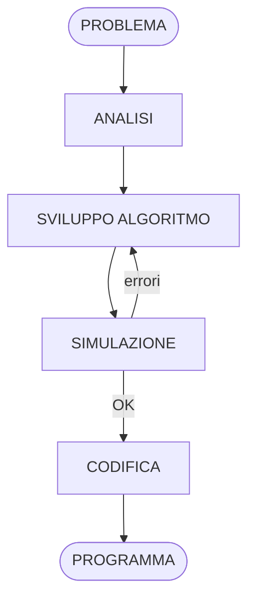

**Analisi** — Prima di tutto si studia il problema con attenzione. Si individuano: i **dati in input** (cosa viene fornito al programma), i **dati in output** (cosa deve produrre) e la **relazione tra I/O** (la formula o la logica che collega input e output). Senza questa fase è facile costruire un algoritmo che risolve il problema sbagliato.

**Sviluppo dell'algoritmo** — Si progetta la sequenza di azioni che trasforma i dati di input nei risultati attesi. Questa è la fase più creativa: lo stesso problema può avere più algoritmi risolutori corretti, ma alcuni sono più efficienti di altri.

**Simulazione** — Prima di scrivere codice, si "esegue a mano" l'algoritmo su un esempio concreto, annotando come cambiano le variabili passo dopo passo. Serve a scovare errori logici prima che diventino bug nel programma.

**Codifica** — Solo a questo punto si traduce l'algoritmo in un linguaggio di programmazione (Python, C, C++, Java, …). La codifica è quasi meccanica: se l'algoritmo è corretto, il programma funzionerà.

---

### Variabili e assegnazione

Ogni algoritmo manipola dei dati. I contenitori che memorizzano questi dati si chiamano **variabili**: immaginale come scatole etichettate in cui si può mettere (e cambiare) un valore in qualsiasi momento durante l'esecuzione.

Una **costante** è invece una scatola il cui contenuto viene fissato all'inizio e non cambia mai (per esempio π = 3,14).

L'operazione fondamentale sulle variabili è l'**assegnazione**, indicata con la freccia `←`. Significa: "calcola il valore a destra della freccia e mettilo nella variabile a sinistra, sovrascrivendo quello precedente."

|Operazione|Esempio|Effetto|
|---|---|---|
|Assegnare un valore costante|`A ← 9`|A contiene 9|
|Copiare il valore di un'altra variabile|`B ← A`|B assume lo stesso valore di A; A non cambia|
|Incrementare|`A ← A + 1`|Il vecchio valore di A viene aumentato di 1 e riscritto in A|
|Espressione generica|`A ← A + B`|Somma A e B, il risultato sovrascrive A; B non cambia|
|Scambio tra due variabili|`AUS ← A` poi `A ← B` poi `B ← AUS`|I valori di A e B vengono scambiati tramite una variabile di appoggio|

> Lo scambio richiede la variabile ausiliaria perché senza di essa il primo assegnamento distruggerebbe il valore originale di A prima che venga salvato.

---

### Simboli degli schemi di flusso

Uno **schema di flusso** (o _flow chart_) è una rappresentazione grafica di un algoritmo. Ogni tipo di azione usa un simbolo diverso; le frecce indicano l'ordine in cui le azioni vengono eseguite. Questo standard grafico rende gli algoritmi leggibili e privi di ambiguità, indipendentemente dal linguaggio di programmazione che si userà poi.

|Simbolo|Tipo|Quando si usa|
|---|---|---|
|Ovale|**Inizio / Fine**|Apre e chiude ogni schema di flusso|
|Rettangolo|**Azione**|Qualsiasi calcolo o assegnazione di variabile|
|Rombo|**Controllo (condizionale)**|Una domanda a cui si risponde Vero o Falso; il flusso si biforca|
|Parallelogramma con I:|**Input**|Il programma chiede un valore all'utente|
|Parallelogramma con O:|**Output**|Il programma mostra un risultato all'utente|
|Freccia|**Flusso**|Collega i blocchi nell'ordine di esecuzione|

Il diagramma seguente mostra tutti i simboli in un unico schema di esempio:

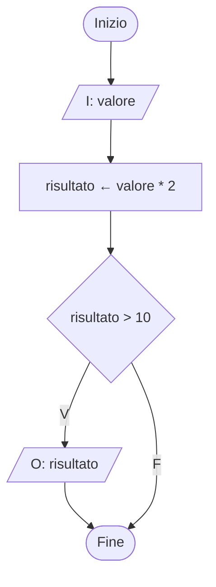

---

### SCF di Sequenza

Lo schema di composizione fondamentale (**SCF**) più semplice è la **sequenza**: le azioni vengono eseguite una dopo l'altra, nell'ordine in cui compaiono nel diagramma, senza deviazioni. È il caso in cui il problema non richiede nessuna scelta e nessuna ripetizione.

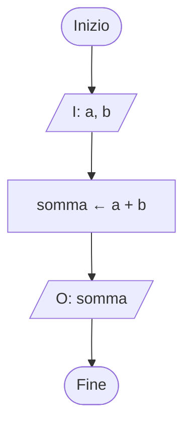

> **Lettura del diagramma**: si inseriscono due valori `a` e `b`, si calcola la loro somma, si visualizza il risultato. Nessuna biforcazione, nessun ritorno.

---

### SCF di Selezione — _se…allora_

Spesso un'azione va eseguita solo in certi casi. Il blocco di controllo (rombo) verifica una condizione: se è **vera** si esegue l'azione, se è **falsa** si salta direttamente oltre, senza fare nulla. Questa struttura si legge "**se** la condizione è vera **allora** esegui l'azione".

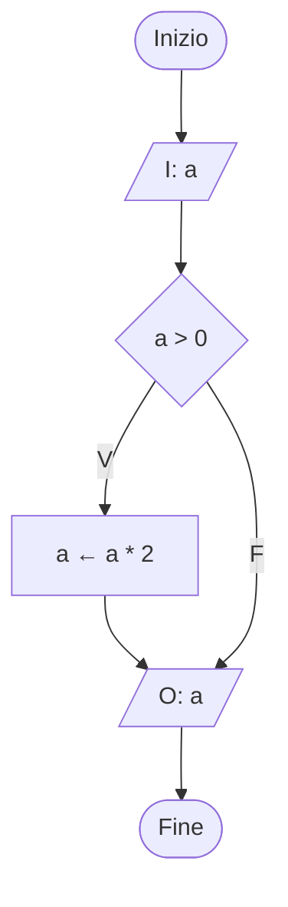

> **Lettura del diagramma**: si legge `a`; se è positivo, viene raddoppiato; in ogni caso si visualizza il valore finale (che può essere stato modificato o no).

---

### SCF di Selezione — _se…allora…altrimenti_

Quando per ogni risposta del test va eseguita un'azione diversa, si usa la struttura completa: se la condizione è **vera** si fa una cosa, **altrimenti** se ne fa un'altra. I due rami si riuniscono dopo, e il flusso riprende insieme.

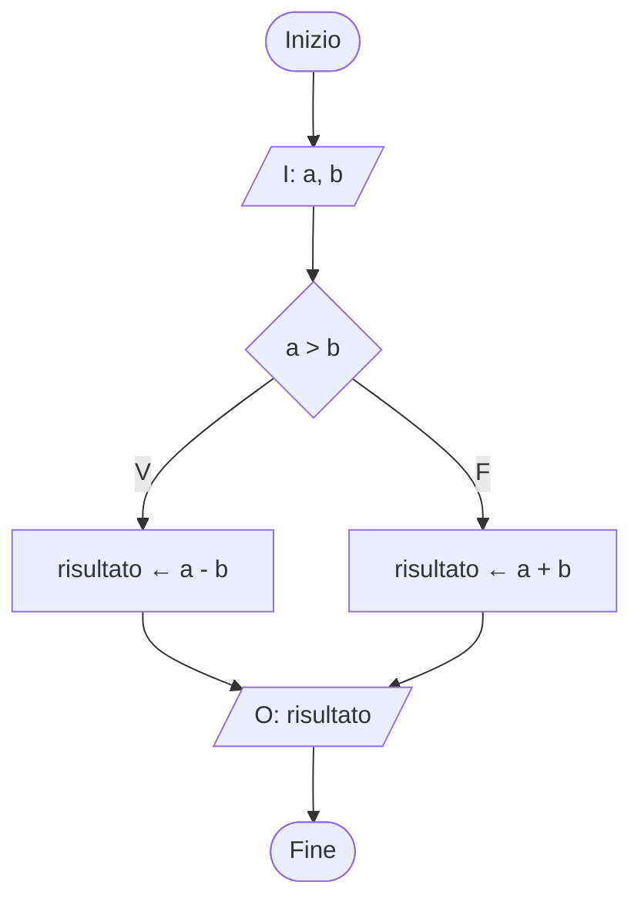

> **Lettura del diagramma**: si leggono `a` e `b`; se `a` è maggiore di `b` si calcola la differenza, altrimenti la somma; il risultato viene visualizzato in entrambi i casi.

---

### SCF di Selezione annidati

Quando i casi da gestire sono più di due, si inserisce un secondo blocco di controllo all'interno del ramo Falso del primo. Si possono annidare quanti rombi si vuole, ottenendo una catena di _se…altrimenti se…altrimenti_.

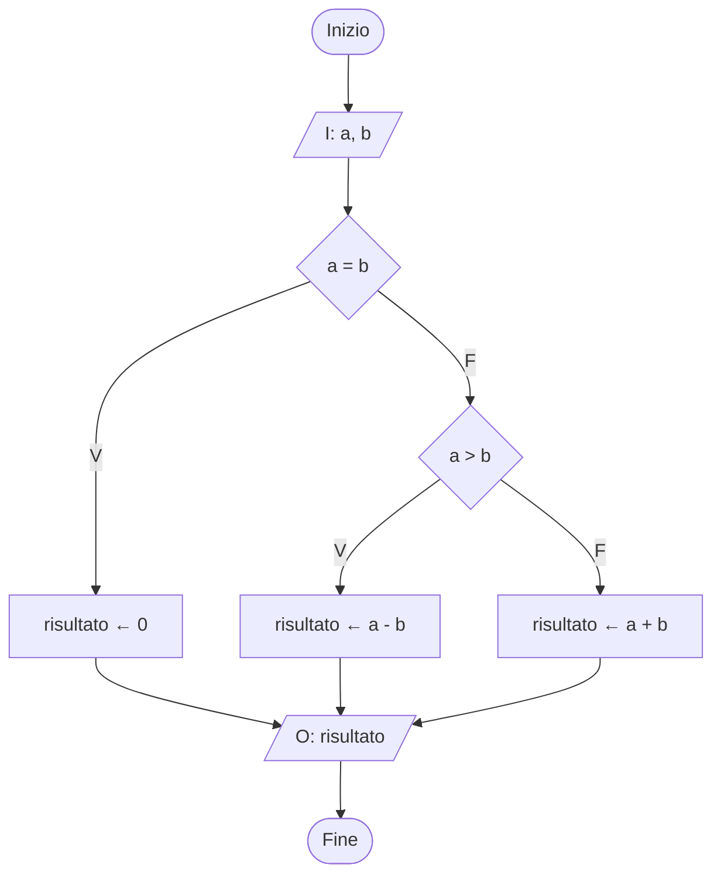

> **Lettura del diagramma**: tre casi possibili — se i valori sono uguali il risultato è 0; se `a` è maggiore si calcola la differenza; altrimenti la somma.

---

### SCF di Ripetizione — Ciclo For (con contatore)

Quando si sa **in anticipo** quante volte ripetere un'operazione, si usa il **ciclo For**. Il blocco esagonale `per n volte` racchiude il **nucleo** — le istruzioni da ripetere — e gestisce automaticamente il conteggio delle iterazioni. Quando il contatore raggiunge `n`, si esce dal ciclo e l'esecuzione prosegue oltre.

Una tecnica molto usata all'interno del ciclo For è la **somma successiva**: si azzera una variabile `somma` prima del ciclo, e ad ogni iterazione le si aggiunge il valore corrente (`somma ← somma + x`). Al termine del ciclo la variabile contiene il totale.

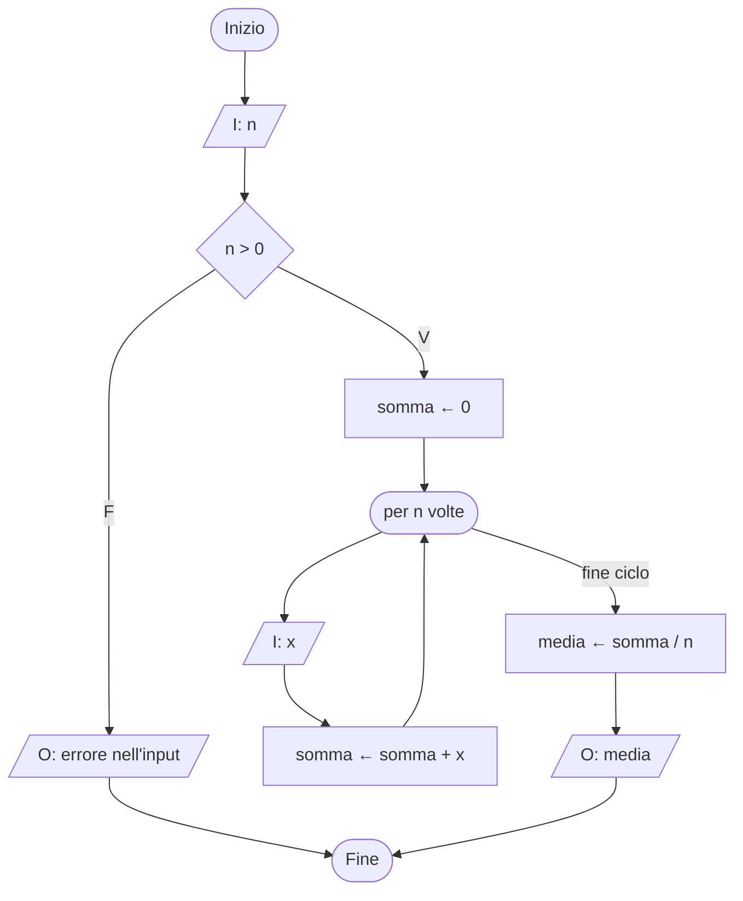

> **Lettura del diagramma**: si legge `n` (verificando che sia positivo); si azzera `somma`; per `n` volte si legge un valore `x` e lo si accumula in `somma`; alla fine si divide per `n` e si visualizza la media.

---

### SCF di Ripetizione — Ciclo Precondizionale

Quando il numero di iterazioni **non è noto in anticipo** e il nucleo potrebbe non dover essere eseguito nemmeno una volta, si usa il ciclo **Precondizionale**: la condizione di controllo è posta **prima** del nucleo. Se fin dall'inizio la condizione è falsa, si salta il nucleo completamente.

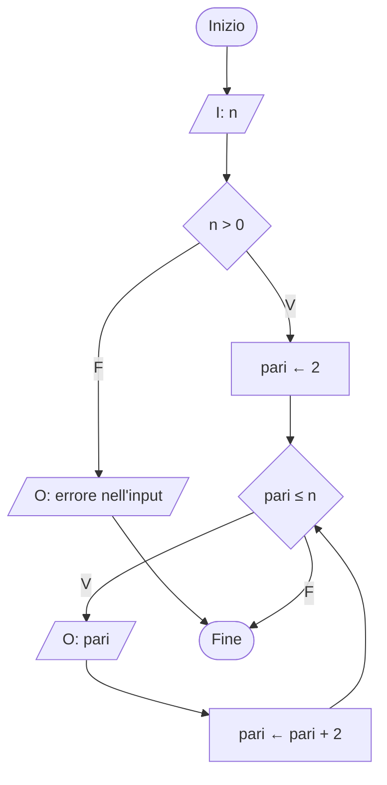

> **Lettura del diagramma**: se `n` è 1, non esistono numeri pari nell'intervallo e il nucleo non viene mai eseguito — il programma termina subito dopo il controllo iniziale. Se invece `n` è grande, il ciclo stampa 2, 4, 6, … fino a raggiungere `n`.

---

### SCF di Ripetizione — Ciclo Postcondizionale

Quando il nucleo deve essere eseguito **almeno una volta** prima di verificare se continuare, il blocco di controllo viene posto **dopo** il nucleo. Questo ciclo è tipico delle situazioni interattive dove l'utente deve sempre fornire almeno un dato.

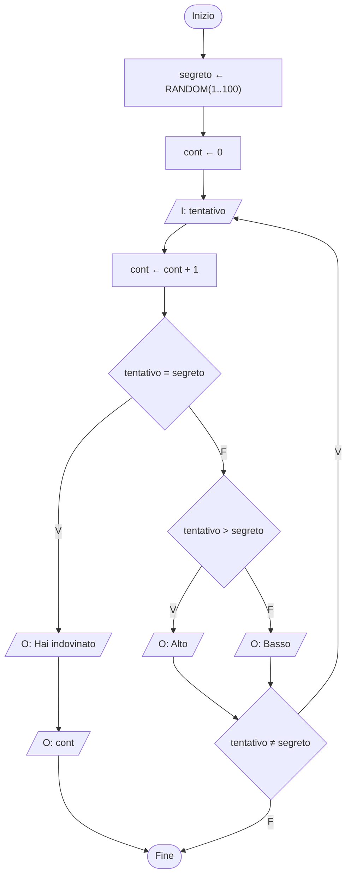

> **Lettura del diagramma**: il computer genera un numero casuale tra 1 e 100. Il giocatore inserisce un tentativo (almeno uno è sempre necessario): se è troppo alto riceve "Alto", se troppo basso "Basso". Il ciclo continua finché non indovina; alla fine viene mostrato il numero di tentativi effettuati.

---

### Riepilogo: quale ciclo scegliere?

Il diagramma seguente riassume la logica di scelta tra i tre tipi di ciclo.

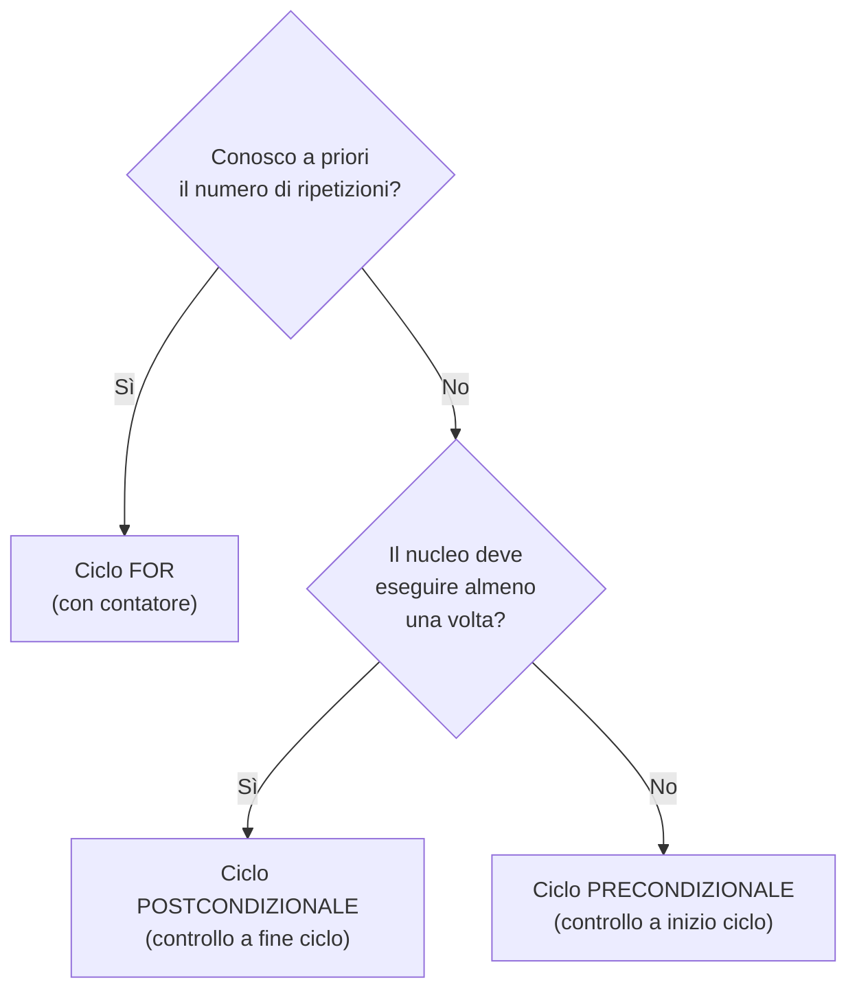

---

### Operatori booleani

All'interno di un blocco di controllo è possibile combinare più condizioni usando gli **operatori booleani**. Questo evita di dover annidare molti rombi e rende il diagramma più leggibile.

|Operatore|Risultato Vero quando…|Esempio|
|---|---|---|
|`C1 AND C2`|**entrambe** le condizioni sono vere|`x > 0 AND x < 100` — x è tra 1 e 99|
|`C1 OR C2`|**almeno una** condizione è vera|`voto = 0 OR voto > 10` — voto fuori range|
|`NOT C`|la condizione è **falsa**|`NOT (a = b)` — a e b sono diversi|

L'esempio seguente mostra come usare AND per trovare il massimo tra tre valori con un solo livello di annidamento invece di tre:

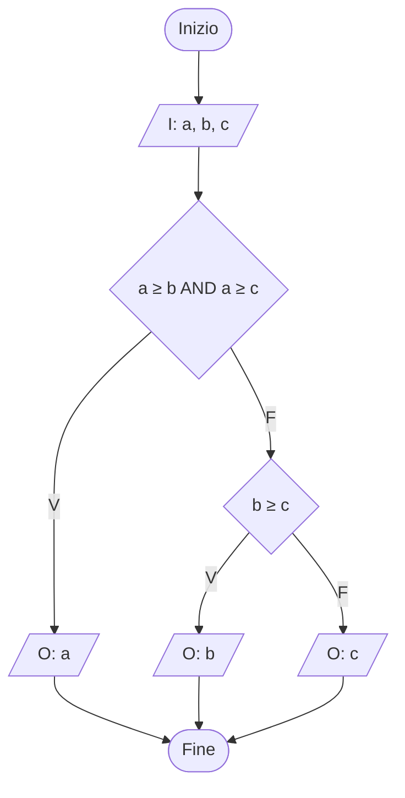

> **Lettura del diagramma**: se `a` è maggiore o uguale sia a `b` che a `c`, allora `a` è il massimo. Altrimenti si confronta `b` con `c`: il maggiore dei due è il massimo complessivo.

---

### Tecniche ricorrenti

Alcune combinazioni di istruzioni compaiono così spesso negli algoritmi da avere un nome proprio.

**Tecnica della somma successiva** — per sommare una serie di valori uno alla volta:

1. Prima del ciclo: `somma ← 0`
2. Nel nucleo: `somma ← somma + x`

Al termine del ciclo `somma` contiene il totale di tutti i valori elaborati.

**Tecnica del contatore** — per contare quante volte si verifica un evento:

1. Prima del ciclo: `cont ← 0`
2. Nel nucleo (solo quando l'evento si verifica): `cont ← cont + 1`

**Variabile ausiliaria per il massimo/minimo** — per trovare il valore più grande (o più piccolo) tra una serie di valori:

1. Prima del ciclo: inizializza `max` al valore più piccolo possibile (o al primo valore letto)
2. Nel nucleo: `se x > max allora max ← x`

Al termine del ciclo `max` contiene il valore più grande incontrato.

**Proprietà di finitezza** — un algoritmo corretto deve sempre terminare. Un ciclo in cui la condizione di uscita non viene mai raggiunta gira all'infinito: questo è un errore logico grave da evitare verificando con attenzione la simulazione.

---

## 2. Esercizi — Selezione e sequenza

> Per ogni esercizio, sviluppa l'analisi (input, output, relazione I/O) e l'algoritmo tramite schema di flusso.

1. Ricevuti in ingresso quattro valori, calcola la somma dei soli valori positivi.
2. Ricevuti in ingresso tre valori, visualizzali in ordine crescente.
3. Ricevute in ingresso la base e l'altezza, calcola l'area di un triangolo.
4. Ricevute in ingresso le lunghezze dei tre lati di un triangolo, determina se si tratta di un triangolo equilatero, isoscele o scaleno.
5. Ricevuta in ingresso l'ampiezza dei due angoli uguali di un triangolo isoscele, calcola l'ampiezza del terzo angolo.
6. Ricevuta in ingresso la circonferenza di un cerchio, calcola la lunghezza del suo raggio.
7. Ricevuti in ingresso quattro voti con valori compresi tra 0 e 10, individua il voto massimo.
8. Ricevuto in ingresso il numero di adulti e di bambini che vanno al circo, calcola il costo totale del biglietto sapendo che gli adulti pagano 12 € e i bambini il 50% del biglietto.
9. Ricevuti in ingresso i nomi di due squadre di calcio e il risultato della partita, visualizza la squadra vincente o, in caso di pareggio, entrambi i nomi delle squadre.
10. Ricevuti in ingresso il prezzo di uno smartphone e lo sconto in percentuale effettuato dal negoziante, calcola il costo scontato.
11. Una pizza margherita costa 5,50 €, una al prosciutto 6,50 €, una al salamino piccante 7,00 €, tutte le altre costano 7,80 €. Ricevuta in ingresso un'ordinazione di pizze da un gruppo di amici, di cui se ne conosce il numero, calcola la spesa media per ciascun amico.
12. A Natale ricevi una cifra in denaro in regalo e decidi di devolvere il 25% di quella cifra in progetti caritatevoli. Ricevuta in ingresso la cifra ricevuta in regalo, calcola quanto dai in beneficenza in totale.
13. Ricevuti in ingresso il costo del panino al bar della scuola e il costo del panino portato da casa, calcola il risparmio che potresti ottenere in un anno supponendo di mangiare un panino tutti i giorni di scuola.
14. Per acquistare una tessera di abbonamento al cinema sai che i primi tre film costano 5,50 € l'uno, dal quarto al settimo costano 4,20 € l'uno e i successivi sino al decimo costano 3,10 € l'uno. Ricevuto in ingresso il numero di film che vuoi acquistare (tra 1 e 10), calcola il costo della tessera.
15. Lo skypass giornaliero a Collina Innevata costa 35 €, ma con il pomeridiano si ha un risparmio del 40% se si è maggiorenni e del 50% se si è minorenni. Ricevuti in ingresso il numero di persone che vanno a sciare e decidono di acquistare lo skypass giornaliero, il numero di persone maggiorenni e minorenni che decidono di acquistare quello pomeridiano, calcola la spesa totale.
16. Alla lotteria del paese vinci uno sconto per l'acquisto di un paio di scarpe. Se l'acquisto è fatto entro una settimana lo sconto è del 40%, mentre se è fatto entro due settimane lo sconto è del 30%. Ricevuti in ingresso il costo effettivo delle scarpe e il numero di giorni che passano prima dell'acquisto, calcola il costo scontato del paio di scarpe.
17. Il costo della bolletta telefonica è calcolato in questo modo: i primi 50 scatti costano 0,20 € l'uno, gli scatti dal 51° sino al 100° costano 0,15 € l'uno, gli ulteriori scatti costano 0,10 € l'uno; a questi è aggiunta una tassa fissa di 2,50 € per le spese. Ricevuto in ingresso il numero di scatti effettuati, calcola il costo della bolletta del telefono.
18. Ricevuto in ingresso un prezzo, calcola il costo finale sapendo che vengono applicati i seguenti sconti a seconda delle fasce di prezzo:
    - prezzo < 100 €: sconto del 5%
    - prezzo ≥ 100 € e < 300 €: sconto del 10%
    - prezzo ≥ 300 €: sconto del 20%
19. Ricevuta in ingresso una data nel formato giorno/mese/anno, controllane la correttezza.
20. Ricevuta in ingresso una data nel formato giorno/mese/anno, ricava il numero ordinale del giorno.

---

## 3. Esercizi — Cicli

> Per ogni esercizio, sviluppa l'analisi (input, output, relazione I/O) e l'algoritmo tramite schema di flusso. Indica quale tipo di ciclo hai scelto e perché.

1. Ricevuti in ingresso _n_ numeri interi positivi, con _n_ intero e positivo anch'esso, conta il numero di valori pari inseriti.
2. Ricevuto in ingresso un numero intero e positivo _n_, calcola la somma dei primi _n_ numeri pari.
3. Ricevuto in ingresso un numero intero e positivo _n_, visualizza i suoi primi _n_ multipli.
4. Ricevute in ingresso _n_ coppie di valori interi positivi, con _n_ intero e positivo anch'esso, conta quante sono costituite da numeri multipli uno dell'altro.
5. Calcola i quadrati perfetti compresi tra 1 e 100.
    
    > **Suggerimento**: sono quadrati perfetti tutti i numeri interi la cui radice quadrata è un numero intero: 1, 4, 9 …
    
6. Visualizza i numeri dispari compresi tra 1 e 1000.
7. Ricevuto in ingresso un numero intero e positivo _n_, visualizza tutti i numeri minori di _n_ che sono potenze di 2.
8. Ricevuti in ingresso due numeri interi e positivi _n1_ e _n2_ (con _n2_ > _n1_), calcola la somma dei numeri dispari e multipli di 3 compresi tra i due valori.
9. Conta e calcola la somma dei numeri interi ricevuti in ingresso sino a che si mantengono positivi.
10. Cerca il valore minimo e massimo tra i numeri interi ricevuti in ingresso sino a che si mantengono positivi.
11. Ricevuti in ingresso i costi degli articoli acquistati al supermercato, calcolane il totale e la media del costo dei soli articoli con prezzo maggiore di 10 €. Termina l'input quando inserisci uno zero.
12. Visualizza la tabellina pitagorica.
13. Ricevuto in ingresso un numero intero _n_, visualizza i suoi divisori interi.
    
    > **Suggerimento**: _x_ è un divisore intero di _n_ se il resto della divisione intera tra _n_ e _x_ è uguale a 0. Per esempio, i divisori di 10 sono 1, 2, 5, 10.
    
14. Ricevuto in ingresso un numero intero _n_, verifica se è un numero perfetto.
    
    > **Suggerimento**: i numeri perfetti sono i numeri uguali alla somma dei loro divisori escluso se stessi. Per esempio, il numero 6 è perfetto in quanto 1 + 2 + 3 = 6.
    
15. Visualizza i numeri perfetti compresi tra 1 e 10 000.
16. Ricevuto in ingresso un numero intero _n_, verifica se è un numero primo.
    
    > **Suggerimento**: i numeri primi sono i numeri divisibili solo per 1 e per se stessi.
    
17. Ricevuto in ingresso un numero intero e positivo _n_, convertilo da decimale a binario.
18. Ricevuto in ingresso un numero binario costituito da _n_ bit, con _n_ intero e positivo, convertilo nel decimale corrispondente.
19. Ricevuto in ingresso un numero _n_ (con _n_ ≥ 0), calcola il suo fattoriale.
    
    > **Suggerimento**: 0! = 1, 1! = 1, 2! = 1 × 2 = 2, 3! = 1 × 2 × 3 = 6 …
    
20. Simula il lancio di un dado per _n_ volte, con _n_ intero e positivo ricevuto in ingresso, e conta quante volte fai coppia e tris.
21. Ricevuto in ingresso un numero _n_ (con _n_ ≥ 0) calcola il suo fattoriale doppio.
    
    > **Suggerimento**: 0!! = 1
    > 
    > - se _n_ è pari, il fattoriale doppio è dato dal prodotto dei numeri pari compresi tra 2 e _n_
    > - se _n_ è dispari, il fattoriale doppio è dato dal prodotto dei numeri dispari compresi tra 1 e _n_
    > 
    > 6!! = 2 × 4 × 6 = 48 — 5!! = 1 × 3 × 5 = 15