## Introduzione ai database relazionali
Un **database** è un insieme organizzato e strutturato di dati, progettato per essere conservato in modo permanente e utilizzato da applicazioni e utenti in modo efficiente. Esso permette di archiviare informazioni, aggiornarle, cercarle e gestirle assicurando coerenza, affidabilità e sicurezza. I database sono fondamentali in qualunque sistema informatico moderno: dai siti web ai servizi bancari, dalle applicazioni gestionali ai sistemi di analisi dei dati.
Un **Database Management System (DBMS)** è il software che consente di creare, gestire e interrogare un database. Tra i compiti principali di un DBMS rientrano:
* la gestione dell’accesso concorrente ai dati
* il controllo dell’integrità
* la protezione delle informazioni
* l’ottimizzazione delle interrogazioni
* il recupero dei dati in caso di errore o guasto
Tra i vari tipi di database, il più diffuso è il **database relazionale**, introdotto formalmente da Edgar F. Codd negli anni ’70. Esso organizza i dati in **tabelle** (relazioni) basate sulla logica matematica degli insiemi. Ogni tabella contiene righe (tuple) e colonne (attributi), e permette di stabilire collegamenti logici fra le informazioni tramite chiavi e vincoli.
In un database relazionale, la progettazione assume un ruolo essenziale: definire la struttura dei dati in modo corretto significa garantire integrità, riduzione delle ridondanze, coerenza e facilità di utilizzo. La fase iniziale della progettazione è detta **progettazione concettuale**, e si basa solitamente sul **modello Entità-Relazione (ER)**. Proprio a partire da questo modello vengono costruiti i diagrammi ER, che forniscono una rappresentazione chiara della realtà da modellare prima della traduzione nel modello relazionale.
Se vuoi, posso ora integrare questa introduzione direttamente nella struttura della dispensa già avviata oppure continuare con la parte successiva.
## Entità e insiemi di entità
### Che cos’è un’entità
Un’entità è qualcosa che esiste (fisicamente o concettualmente) e che vogliamo rappresentare nel nostro sistema informativo perché ha un ruolo significativo nel dominio. Può essere:
* un oggetto fisico: Studente, Docente, Libro, Prodotto
* una persona o organizzazione: Cliente, Azienda, Fornitore
* un evento: Ordine, Pagamento, Prenotazione
* un concetto: Corso, Categoria, Ruolo
Dal punto di vista del modello ER, quando parliamo di “entità” in senso rigoroso dovremmo distinguere:
* tipo di entità (entity type): la classe, ad esempio “Studente” in generale
* istanza di entità (entity): un singolo studente concreto, ad esempio lo studente con matricola 12345
Nei diagrammi e nelle spiegazioni però, spesso per brevità si usa “entità” per indicare il tipo di entità.
### Insieme di entità
Un insieme di entità (entity set) è semplicemente l’insieme di tutte le entità dello stesso tipo.
Esempi:
* l’insieme di tutti gli studenti dell’università
* l’insieme di tutti i corsi offerti in un certo anno accademico
* l’insieme di tutti gli ordini registrati nel sistema
Nei diagrammi ER gli insiemi di entità sono rappresentati come rettangoli con il nome dell’entità al loro interno.
Esempio grafico (entità Studente con alcuni attributi):
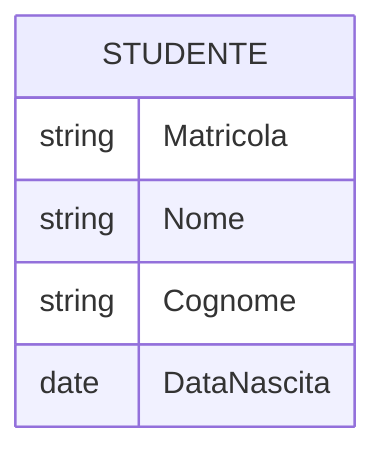
---
### Attributi
#### Definizione
Gli attributi sono le proprietà che descrivono un tipo di entità (oppure una relazione, ma per ora concentriamoci sulle entità). Ogni attributo assume un valore per ogni istanza di entità. ([titan.dcs.bbk.ac.uk][3])
Esempio per l’entità Studente:
* Matricola
* Nome
* Cognome
* DataNascita
Ogni singolo studente avrà un valore specifico per ognuno di questi attributi.
#### Tipologie di attributi
Nella teoria ER si distinguono varie categorie di attributi; è importante conoscerle perché influenzano sia la modellazione sia la traduzione nel modello relazionale.
1. Attributi semplici
   * Non sono ulteriormente scomponibili dal punto di vista del modello.
   * Esempi: CodFiscale, Matricola, Età (se considerata come singolo valore numerico).
2. Attributi composti
   * Possono essere scomposti in sotto-attributi che hanno significato autonomo.
   * Esempio classico: Indirizzo, scomponibile in Via, NumeroCivico, CAP, Città, Provincia.
   * Nel diagramma ER tradizionale, l’attributo composto è collegato a più sotto-attributi.
   Esempio concettuale:
   ```mermaid
   erDiagram
       INDIRIZZO {
           string Via
           int NumeroCivico
           string CAP
           string Citta
       }
   ```
3. Attributi monovalore
   * Per ogni istanza di entità è previsto un solo valore per quell’attributo.
   * Esempi: DataNascita, Matricola, CodDipartimento.
4. Attributi multivalore
   * Per una singola entità possono esistere più valori per lo stesso attributo.
   * Esempi:
     * NumeroTelefono per un Cliente (più numeri per la stessa persona)
     * Email per un Utente (indirizzo personale, aziendale, ecc.)
   * A livello concettuale, un attributo multivalore spesso porta alla modellazione di una nuova entità o tabella separata nella fase relazionale.
5. Attributi derivati
   * Il loro valore può essere calcolato a partire da altri attributi.
   * Esempio: Età può essere derivata da DataNascita e dalla data corrente; TotaleOrdine può essere derivato dalla somma delle righe d’ordine.
   * Di norma non si memorizzano esplicitamente gli attributi derivati nel database, per evitare ridondanze e incoerenze, salvo esigenze di efficienza.
#### Valori NULL e vincolo NOT NULL
Nella progettazione è necessario stabilire se un attributo può mancare oppure no.
- Un attributo **NOT NULL** deve sempre avere un valore (es. Matricola di uno Studente).
- Un attributo che **ammette NULL** può non avere un valore quando l’informazione è sconosciuta, non applicabile o facoltativa (es. SecondoNumeroTelefono).
- Gli attributi che formano una **chiave primaria** non possono mai essere NULL.
- Gli attributi che formano una **chiave esterna** possono essere NULL o NOT NULL a seconda che la partecipazione alla relazione sia parziale o totale.
#### Scelta degli attributi: aspetti progettuali
Quando si definiscono gli attributi di un’entità, è importante:
* includere solo le informazioni effettivamente utili al sistema (evitando dati inutili);
* separare i dati che hanno significato indipendente (es. non usare un unico campo “NomeCompleto” se Nome e Cognome servono separati per ricerca, ordinamento, ecc.);
* valutare se un’informazione è realmente un attributo dell’entità oppure merita una entità separata (es. lo “StatoOrdine” può essere un attributo, ma la “Storia degli stati di un ordine” è un concetto più complesso e potrebbe essere un’entità a sé).
---
### Identificatori e chiavi
#### Che cos’è un identificatore
Ogni istanza di un’entità deve essere distinguibile da tutte le altre. Un **identificatore** (o chiave) è un insieme di uno o più attributi tali che:
* non esistono due entità diverse con lo stesso valore per tutti gli attributi dell’insieme
* l’identificatore è “minimale”: se togliamo uno degli attributi, la proprietà di unicità non regge più
Nel contesto relazionale, un identificatore diventerà una chiave candidata, e uno di questi identificatori sarà scelto come chiave primaria (PK).
#### Esempi di identificatore
* Studente: Matricola
* Corso: CodCorso
* Libro: ISBN
* Persona: CodFiscale (se garantisce unicità nel contesto considerato)
Nel diagramma ER si sottolineano di solito gli attributi che costituiscono l’identificatore.
Esempio (entità Studente con identificatore Matricola):

Potremmo anche immaginare un identificatore composto, ad esempio per un’entità che rappresenta “EsameSostenuto” con attributi (MatricolaStudente, CodCorso, DataAppello): l’insieme di questi tre attributi potrebbe identificare univocamente ciascuna istanza.
#### Chiave naturale e chiave surrogata
Nella progettazione si distingue spesso tra:
* chiave naturale: basata su un attributo “significativo” del dominio (CodFiscale, ISBN, CodCorso)
* chiave surrogata: un identificatore artificiale introdotto apposta, spesso un numero progressivo o un UUID (es. IdStudente, IdOrdine)
Scelte tipiche:
* se esiste un identificatore naturale stabile, non riservato, non soggetto a cambiamenti, spesso è comodo usarlo come chiave;
* se l’identificatore naturale potrebbe cambiare, o è sensibile (es. dati personali), o è complicato, si introduce una chiave surrogata.

---
## Relazioni nel modello ER
###  Che cos’è una relazione
Una relazione è un’associazione logica tra due o più insiemi di entità. Rappresenta un fatto significativo del dominio, ad esempio:
* uno Studente sostiene un Esame
* un Cliente effettua un Ordine
* un Dipendente lavora in un Dipartimento
* uno Studente frequenta un Corso
Nei diagrammi ER, una relazione collega entità tramite un nome che descrive l’associazione.
---
###  Partecipanti alla relazione
Ogni relazione coinvolge due o più entità, ognuna con un ruolo specifico.
Esempi:
* “LavoraIn”: DOCENTE → DIPARTIMENTO
* “Iscrizione”: STUDENTE → CORSO
* “Acquisto”: CLIENTE → PRODOTTO
---
### Partecipazione totale e parziale
La partecipazione di un’entità a una relazione indica se ogni occorrenza dell’entità deve obbligatoriamente comparire nella relazione (partecipazione totale) oppure se la presenza nella relazione è facoltativa (partecipazione parziale). La partecipazione permette di distinguere tra vincoli di obbligatorietà e vincoli di scelta all’interno del modello ER e influisce sulla successiva traduzione nel modello relazionale.
#### Partecipazione totale
Un’entità ha partecipazione totale a una relazione quando ogni sua istanza deve necessariamente comparire nella relazione. Questo significa che non può esistere un’istanza dell’entità senza essere associata almeno a un'istanza dell’altra entità coinvolta.
Esempio: ogni carta d’identità deve appartenere a una persona.
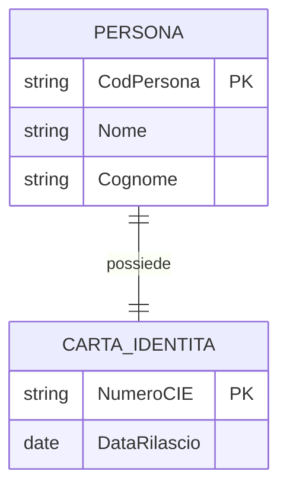
In questo caso l’entità CARTA_IDENTITA ha partecipazione totale: una carta d’identità non può esistere senza la persona a cui appartiene.
#### Partecipazione parziale
Un’entità ha partecipazione parziale a una relazione quando può esistere anche senza comparire nella relazione. La partecipazione alla relazione è facoltativa e non vincolata.
Esempio: un reparto può esistere anche senza docenti assegnati.
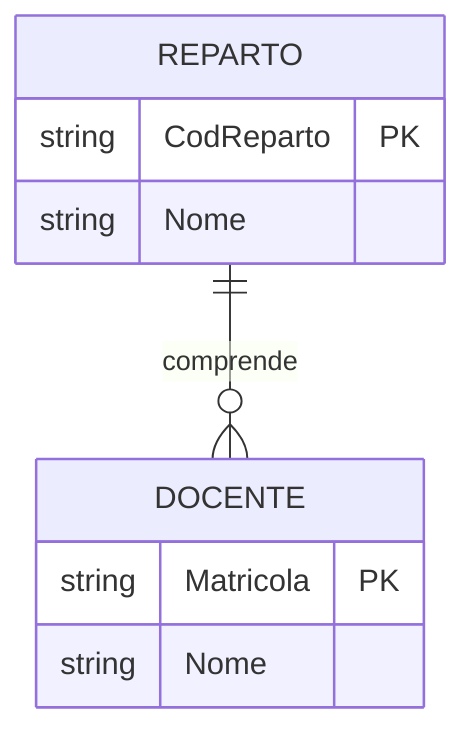
In questo caso l’entità DOCENTE ha partecipazione parziale: un docente può esistere anche prima di essere assegnato a un reparto.
#### Implicazioni sul modello relazionale
La partecipazione determina la posizione della chiave esterna nella traduzione al modello relazionale. La regola è la seguente:
* nella partecipazione totale la chiave esterna va nella tabella dell’entità che partecipa totalmente
* nella partecipazione parziale la chiave esterna non deve essere inserita nella tabella dell’entità con partecipazione parziale
La partecipazione totale indica una dipendenza logica da un’altra entità e guida la struttura delle relazioni durante la trasformazione del modello ER.

###  Cardinalità delle relazioni
La cardinalità rappresenta quante istanze di un’entità possono essere associate a una istanza dell’entità dall’altro lato.
####  Relazione 1 : 1
A ogni istanza dell’entità A può corrispondere al massimo una istanza dell’entità B.
Esempio:
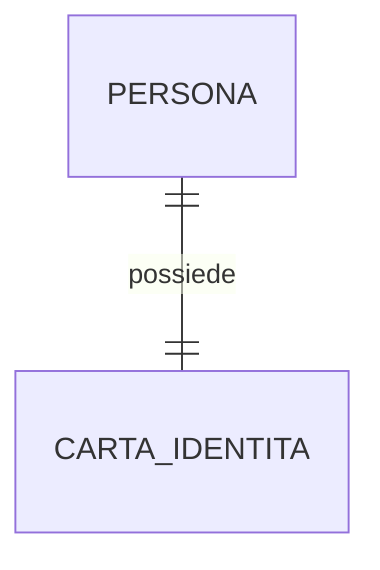
---
####  Relazione 1 : N
Una istanza dell’entità A può essere associata a molte istanze dell’entità B, ma non viceversa.
Esempio:
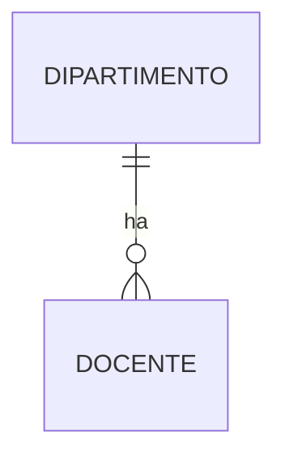
---
####  Relazione N : M
Una istanza di A può essere associata a molte istanze di B e viceversa.
Esempio:
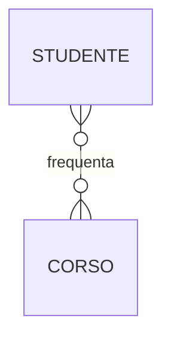
---
###  Relazioni con attributi
Quando la relazione possiede attributi propri (data, quantità, prezzo, voto, ruolo, ecc.), si rappresenta tramite un’entità associativa.
Esempio:
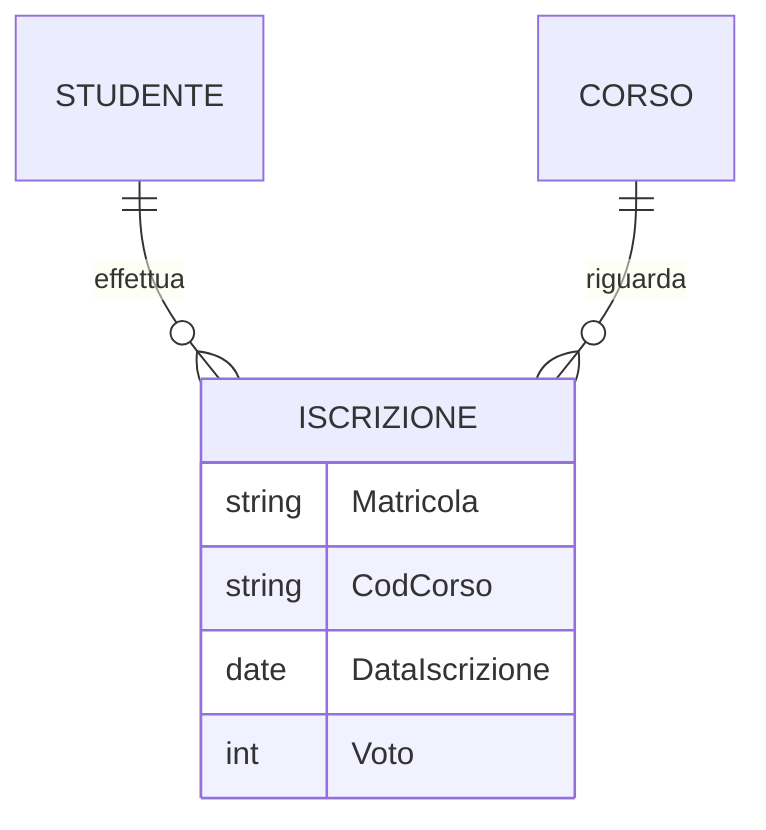
---
###  Relazioni n-arie (oltre le binarie)

Il modello ER permette relazioni ternarie o di ordine superiore.

Esempio:
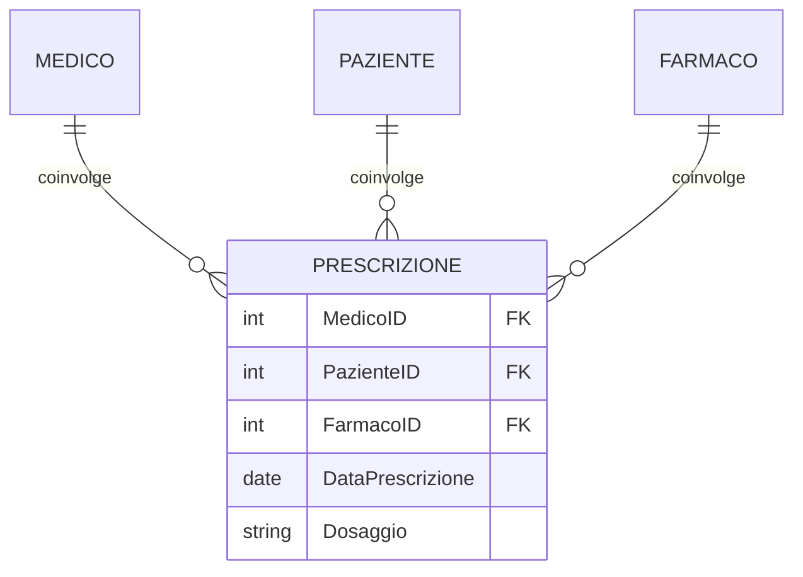


> [!warning] Nota bene
> Generalmente le relazioni ternarie o più sono fortemente sconsigliate. Sempre meglio scomporle in più relazioni binarie quando possibile, ovvero quasi sempre.


---
##  Traduzione delle relazioni nel modello relazionale
La traduzione del modello ER nel modello relazionale consiste nel convertire entità e relazioni in **tabelle**, ciascuna con chiavi primarie, chiavi esterne e vincoli che riflettono le cardinalità e la partecipazione.

---
###  Traduzione delle relazioni 1 : 1
####  Caso generale
Una relazione 1:1 può essere implementata tramite:
1. chiave esterna in A che riferisce B
2. chiave esterna in B che riferisce A
3. tabella autonoma (solo se la relazione ha attributi)
####  Criterio di scelta
Basato sulla partecipazione:
* partecipazione totale → la FK va lì
* relatione con attributi → tabella separata
####  Esempio

####  Traduzione relazionale
$$
\text{PERSONA}(
\underline{\text{CodPersona}},
\text{Nome},
\text{Cognome}
)
$$
$$
\text{CARTA\_IDENTITA}(
  \underline{\text{NumeroCIE}},
  \text{DataRilascio},
  \text{CodPersona}^{\text{PERSONA}}
)
$$

---
###  Traduzione delle relazioni 1 : N
####  Regola
La PK del lato **1** diventa FK nel lato **N**.
####  Esempio
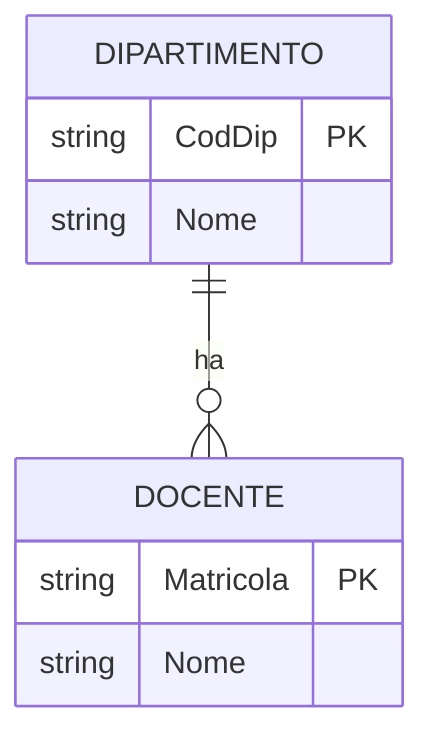
####  Traduzione relazionale
$$
\text{DIPARTIMENTO}(
\underline{\text{CodDip}},
\text{Nome}
)
$$
$$
\text{DOCENTE}(
\underline{\text{Matricola}},
\text{Nome},
\text{CodDip}^{\text{DIPARTIMENTO}}
)
$$
---
###  Traduzione delle relazioni N : M
Le relazioni molti-a-molti richiedono una **tabella associativa** con PK composta.
####  Esempio
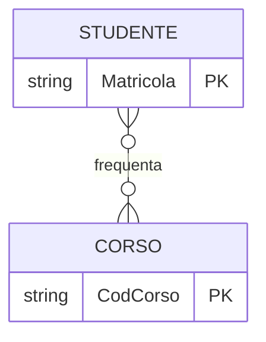
####  Traduzione relazionale
$$
\text{STUDENTE}(
\underline{\text{Matricola}}
)
$$
$$
\text{CORSO}(
\underline{\text{CodCorso}}
)
$$
$$
\text{FREQUENZA}(
\underline{\text{Matricola}^{\text{STUDENTE}}},
\underline{\text{CodCorso}^{\text{CORSO}}}
)
$$
---
###  Traduzione delle relazioni con attributi
Le relazioni con attributi diventano sempre tabelle autonome.
####  Esempio

####  Traduzione relazionale
$$
\text{ISCRIZIONE}(
\underline{\text{Matricola}^{\text{STUDENTE}}},
\underline{\text{CodCorso}^{\text{CORSO}}},
\text{DataIscrizione},
\text{Voto}_{\circ}
)
$$
---
###  Traduzione delle relazioni n-arie
Le relazioni ternarie o superiori diventano tabelle con una FK per ogni entità coinvolta e PK composta da tutte le chiavi esterne.
####  Esempio
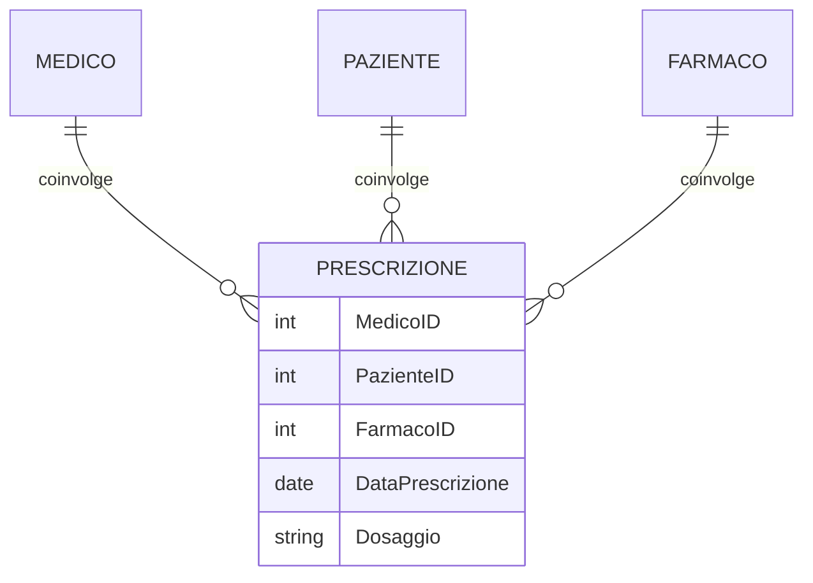
####  Traduzione relazionale
$$
\text{PRESCRIZIONE}(
\underline{\text{MedicoID}^{\text{MEDICO}}},
\underline{\text{PazienteID}^{\text{PAZIENTE}}},
\underline{\text{FarmacoID}^{\text{FARMACO}}},
\text{DataPrescrizione},
\text{Dosaggio}
)
$$

---
## Costruzione del modello ER a partire da una consegna testuale
Quando ci viene fornita una **consegna scritta** (un testo descrittivo, un capitolato, una specifica informale), il nostro obiettivo è trasformare quel testo in un **modello ER corretto, completo e coerente**.
Si tratta di una delle abilità più importanti nella progettazione concettuale.
Qui spieghiamo **metodicamente**, passo per passo, come procedere.

---
###  1. Lettura globale e individuazione del dominio
La prima cosa da fare è leggere l’intero testo per capire **di cosa si parla**, cioè qual è il contesto applicativo.
Domande guida:
* Chi sono i protagonisti del sistema?
* Quali oggetti gestiamo?
* Quali processi o azioni compaiono nel testo?
A questo stadio non si cercano ancora entità o relazioni precise: si costruisce la visione d’insieme.
---
###  2. Identificazione preliminare delle entità candidate
Dal testo si estraggono **sostantivi significativi**, soprattutto quelli che indicano:
* persone (Studente, Cliente, Dipendente)
* oggetti (Prodotto, Libro, Auto)
* concetti (Corso, Categoria, Reparto)
* eventi (Ordine, Prenotazione, Pagamento)
Il trucco è:
> ogni volta che nel testo compare un sostantivo che “sembra qualcosa che il sistema deve memorizzare in modo autonomo”, probabilmente è un’entità.
Non tutte le entità candidate sono poi entità vere: alcune diventeranno relazioni, altre attributi, altre verranno scartate.
---
###  3. Identificazione delle relazioni candidate
Di solito emergono dai **verbi** o espressioni che li sostituiscono.
Esempi:
* “uno studente **si iscrive** a un corso” → relazione
* “il cliente **effettua** un ordine” → relazione
* “un libro **è scritto** da un autore” → relazione
* “un prodotto **appartiene** a una categoria” → relazione
In generale:
> ogni frase che descrive un collegamento logico tra due (o più) entità candidate → relazione.
---
###  4. Individuazione degli attributi
Gli attributi vengono spesso introdotti nella consegna come:
* caratteristiche (“ogni studente ha nome, cognome…”)
* proprietà numeriche (“il prodotto ha un prezzo”)
* proprietà descrittive (“il corso ha un titolo”)
* riferimenti temporali (“la prenotazione ha una data”)
Gli attributi:
* si collegano all’entità cui appartengono
* se descrivono una relazione *e solo quella*, vanno nella relazione (che poi diventa entità associativa nel modello relazionale)
---
###  5. Determinazione delle cardinalità e partecipazioni
Dal testo bisogna ricavare **quante entità** possono essere associate a quante altre.
Esempi di indicatori nel testo:
* “un cliente può effettuare molti ordini” → 1:N
* “un corso può essere seguito da molti studenti” → N:M
* “ogni ordine appartiene a un unico cliente” → 1:N (partecipazione totale sul lato “ordine”)
* “un paziente può essere seguito da più medici” → N:M
Indicatori di partecipazione totale:
* “ogni X deve avere…”
* “tutti gli X devono essere associati a…”
* “non esiste X senza Y”
---
###  6. Eliminazione delle false entità
Non tutto quello che sembra entità lo è veramente.
Si eliminano:
* Aggregati puramente descrittivi → diventano attributi
  (es. “Indirizzo” può diventare attributo composto)
* Nomi che non rappresentano oggetti autonomi
* Concetti che sono semplici proprietà di altri
Esempio:
* “StatoOrdine” (spedito, pagato, ecc.) è quasi sempre **attributo**, non entità.
---
###  7. Gestione delle relazioni N:M e con attributi
Ogni relazione N:M del modello ER:
* è corretta nel modello concettuale
* diventa tabella associativa nel relazionale
Relazioni con attributi:
* sono entità associative
* devono essere mantenute nel modello ER come tali
---
###  8. Identificazione delle chiavi primarie (PK)
Si decide, per ogni entità, quale attributo (o insieme di attributi):
* identifica univocamente le sue istanze
* è stabile
* è semanticamente corretto
Se il dominio non prevede identificatori naturali robusti:
* si introduce una PK artificiale
---
###  9. Disegno del modello ER definitivo
A questo punto si possono disegnare:
* entità con attributi
* relazioni con cardinalità
* relazioni con attributi (entità associative)
* partecipazione totale o parziale
* scelte coerenti di nomi
L’obiettivo è ottenere un modello coerente, privo di ridondanze concettuali e leggibile.
---
###  10. Verifica del modello con la consegna
Ultimo passaggio:
> Riprendere la consegna originale e verificare che ogni frase sia rappresentata nel modello ER.
* Ogni oggetto citato deve apparire come entità o attributo
* Ogni azione deve apparire come relazione
* Ogni vincolo deve essere rappresentato come cardinalità/partecipazione
* Nessuna informazione deve essere persa
* Nessun elemento superfluo deve essere stato aggiunto
---

## Esempio completo: dal testo al modello ER
###  Consegna testuale

> L’azienda deve gestire i dipendenti, i reparti e i progetti.
> Ogni dipendente ha un codice identificativo, nome, cognome e può avere un numero di telefono interno aggiuntivo.
> Ogni reparto ha un codice e un nome, e deve avere un responsabile, che è un dipendente. Ogni dipendente appartiene ad un solo reparto.
> Ogni progetto ha un codice, un nome e un budget.
> Ogni dipendente può partecipare a più progetti e per ogni partecipazione devono essere registrati le ore lavorate e il ruolo nel progetto.
> L’azienda assegna ad ogni progetto una sede operativa, identificata da un codice sede e dall’indirizzo. Ogni sede appartiene a una sola città.
> Ogni città è identificata dal nome e dal CAP.
> Una sede non può esistere senza la città in cui si trova.
---
###  Identificazione delle entità
####  Entità individuate
* DIPENDENTE
* REPARTO
* PROGETTO
* SEDE (entità debole)
* CITTA
####  Entità associative
* PARTECIPAZIONE (derivante dalla relazione N:M)
---
###  Attributi delle entità
**DIPENDENTE**
* CodDip *(PK)*
* Nome
* Cognome
* TelefonoInterno *(nullabile)*
**REPARTO**
* CodReparto *(PK)*
* Nome
**PROGETTO**
* CodProgetto *(PK)*
* Nome
* Budget
**CITTA**
* NomeCitta *(PK)*
* CAP
**SEDE (entità debole)**
* CodSede *(PK parziale)*
* Indirizzo
* dipende da CITTA
---
###  Relazioni individuate
**1 : N — REPARTO → DIPENDENTE**
Ogni reparto ha molti dipendenti.
Ogni dipendente appartiene a un solo reparto.

**1 : 1 — REPARTO ↔ RESPONSABILE (DIPENDENTE)**
Ogni reparto ha un responsabile.
Un dipendente può essere responsabile al massimo di un reparto.

**N : M — DIPENDENTE ↔ PROGETTO**
Con attributi:
* OreLavorate
* Ruolo
Diventa PARTECIPAZIONE.

 **1 : N — CITTA → SEDE**
Ogni città ha più sedi.
Ogni sede appartiene a una sola città e non può esistere senza di essa → entità debole.

---
####  Modello ER
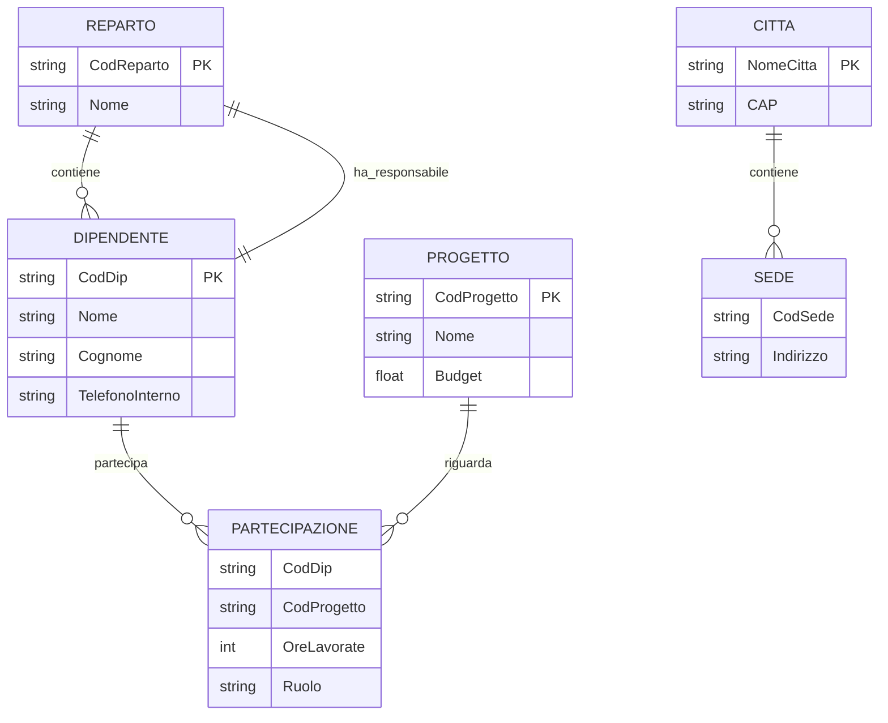
---
####  Traduzione nel modello relazionale
$$
\text{DIPENDENTE}(
\underline{\text{CodDip}},
\text{Nome},
\text{Cognome},
\text{TelefonoInterno}_{\circ},
\text{CodReparto}^{\text{REPARTO}}
)
$$
$$
\text{REPARTO}(
\underline{\text{CodReparto}},
\text{Nome},
\text{Responsabile}^{\text{DIPENDENTE}}
)
$$
$$
\text{PROGETTO}(
\underline{\text{CodProgetto}},
\text{Nome},
\text{Budget}
)
$$
$$
\text{PARTECIPAZIONE}(
\underline{\text{CodDip}^{\text{DIPENDENTE}}},
\underline{\text{CodProgetto}^{\text{PROGETTO}}},
\text{OreLavorate},
\text{Ruolo}
)
$$
$$
\text{CITTA}(
\underline{\text{NomeCitta}},
\text{CAP}
)
$$
$$
\text{SEDE}(
\underline{\text{CodSede}},
\underline{\text{NomeCitta}^{\text{CITTA}}},
\text{Indirizzo}
)
$$
---
